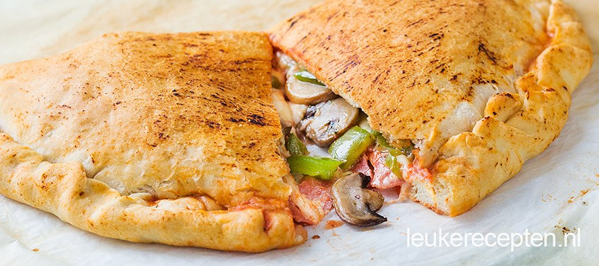

# Hoe maak je een Pizza Calzone?

## Bereiding

###
Maak de pizzabodems volgens recept of verpakking. Verwarm de oven op 240 graden. Snijd de paprika in blokjes en de champignons indien nog nodig in plakjes. Fruit deze groenten aan in een pan met een beetje olie zodat het vocht er grotendeels uit gaat. Verdeel 100 ml saus over de helft van één ronde pizzabodem en houd ongeveer 1 cm van de rand vrij. Beleg met de helft van de salami, mozzarella en de gebakken paprika en champignons en geraspte kaas. En verdeel nog een beetje extra italiaanse kruiden over de vulling.

###
Vouw de lege helft van de pizza over de vulling en druk de randen goed vast. Vouw ze iets om naar binnen. Meng een klein beetje olie met een beetje pizzasaus en bestrijk de bovenzijde hiermee. Het handige aan een pizza calzone is dat je er makkelijk 2 naast elkaar op de bakplaat kunt leggen. Bak de pizza’s in ca 15 minuten mooi bruin en krokant.